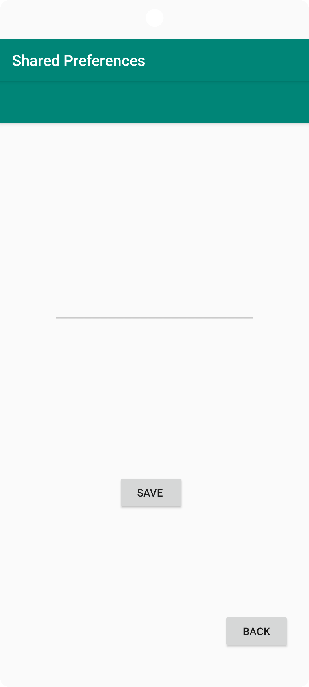
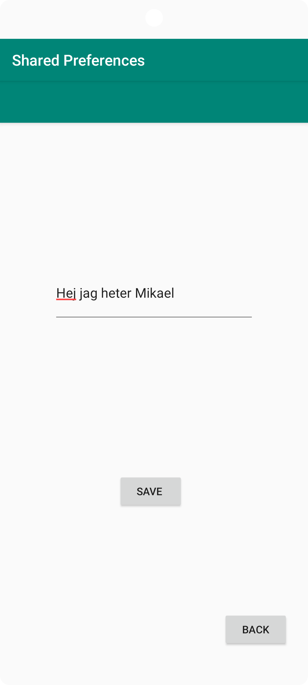
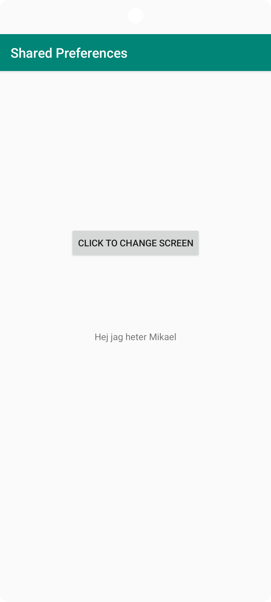

# Rapport
Innan jag skapade själva preferencen så byggde jag skelettet för applikationen, alltså SecondActivityn, knappar för att spara och gå fram och tillbaka mm.
Dessa listeners sattes på knapparna i varsin activity
```
Button button = (Button) findViewById(R.id.buttonChangeScreen);
        button.setOnClickListener(new View.OnClickListener() {
            @Override
            public void onClick(View view) {
                Intent intent = new Intent(MainActivity.this, SecondActivity.class);
                startActivity(intent);
            }
        });
        
        
Button backButton = (Button) findViewById(R.id.buttonBack);        
        backButton.setOnClickListener(new View.OnClickListener() {
            @Override
            public void onClick(View view) {
                Intent intent = new Intent(SecondActivity.this, MainActivity.class);
                startActivity(intent);
            }
        });
```
Efter detta skapade jag en metod som hämtar och sparar den ifyllda datan till Shared Preferences. Denna metod kallas i onClick listenern för "Save" knappen.
```
public void saveData(){
    SharedPreferences sharedPreferences = getSharedPreferences(shared_Preferences, MODE_PRIVATE);
    SharedPreferences.Editor editor = sharedPreferences.edit();
    editor.putString(shared_Preferences, editText.getText().toString()).apply();
}
```
Därefter har jag även skapat en metod i onResume som hämtar datan från shared preferences och visar den i TextViewn.
```
@Override
    public void onResume() {
        super.onResume();
        SharedPreferences sharedPreferences = getSharedPreferences(SecondActivity.shared_Preferences, MODE_PRIVATE);
        String textFromEditView = sharedPreferences.getString(SecondActivity.shared_Preferences, "");
        textView.setText(textFromEditView);
    }
```




